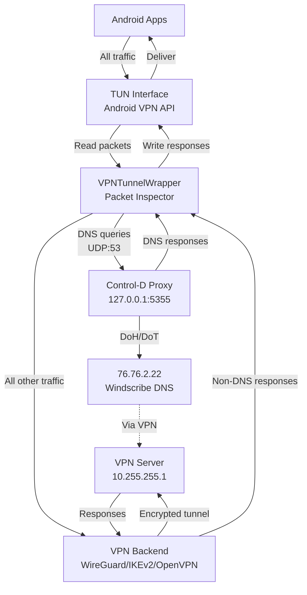

# DNS Tunneling Architecture

## Quick Summary
Windscribe Android intercepts DNS queries (UDP port 53) and routes them through a local Control-D proxy for DoH/DoT encryption, while all other traffic goes directly through the VPN tunnel.

**Last Updated**: 2026-07-06

---

## 🔄 Main Flow Diagram



---

## 📦 Component Details

### VPNTunnelWrapper (`common/src/main/java/com/windscribe/common/VPNTunnelWrapper.java`)

**Purpose**: Intercept and filter packets between Android apps and VPN backend

**Key Functions**:
- Creates Unix socket pair (fd0/fd1) for packet interception using `SOCK_SEQPACKET`
- Identifies DNS packets (UDP port 53) and routes them to Control-D
- Manages DNS query/response tracking with transaction IDs
- Implements non-blocking DNS handling with timeout support (5 seconds)
- Provides detailed packet logging to logcat (verbose level) when enabled via advanced params
- Bypasses first `windscribe.com` query for connectivity testing

### Control-D Proxy (`wgtunnel/tools/libwg-go/cd-api.go`)

**Purpose**: Convert plain DNS to encrypted DoH/DoT

**Configuration** (`config.toml`):
```toml
[listener.0]
ip = "127.0.0.1"
port = 5355

[upstream.0]
bootstrap_ip = "76.76.2.22"
type = "doh"  # or "dot"
```

---

## 🔀 Packet Processing Logic

```
┌─────────────────────────────────────────────┐
│         Packet from Android Apps            │
└──────────────────┬──────────────────────────┘
                   ▼
           ┌───────────────┐
           │ UDP Port 53?  │───No──→ Forward to VPN Backend (fd1)
           └───────┬───────┘
                  Yes
                   ▼
           ┌───────────────┐
           │ First         │
           │ windscribe.   │───Yes─→ Forward to VPN Backend
           │ com query?    │         (connectivity test)
           └───────┬───────┘
                   No
                   ▼
       Add to DNS Queue (max 300)
                   ▼
        Extract Transaction ID
                   ▼
    Store in pendingQueries Map
                   ▼
    Send to 127.0.0.1:5355 (Control-D)
                   ▼
    Schedule 5-second timeout check
                   ▼
    Control-D converts to DoH/DoT
                   ▼
    Response received → Match TxID
                   ▼
    Rebuild IP packet & send to Apps
```

**Non-blocking DNS Handling**:
- DNS queries tracked by transaction ID (first 2 bytes of DNS packet)
- Responses matched asynchronously using `ConcurrentHashMap`
- Timeout handler removes stale queries after 5 seconds
- Multiple DNS queries can be in-flight simultaneously

---

## 🔌 File Descriptor Magic

```
Android VPN Service creates TUN interface
            │
            ▼
    ┌───────────────┐
    │  Original TUN │
    │      FD       │
    └───────┬───────┘
            │
    VPNTunnelWrapper creates
    Unix socket pair
            │
    ┌───────┴────────┐
    ▼                ▼
┌────────┐      ┌────────┐
│  fd0   │←────→│  fd1   │
└────────┘      └────────┘
     │               │
VPNTunnel       VPN Backend
 uses fd0        gets fd1
```

**Data Flow**:
- `Apps → TUN → fd0 (read) → Filter → fd1 (write) → VPN Backend`
- `VPN Backend → fd1 (write) → fd0 (read) → TUN → Apps`

---

## 🚦 What Gets Intercepted

| Traffic Type | Port | Action | Reason |
|-------------|------|--------|---------|
| DNS (UDP) | 53 | ✅ Intercepted → Control-D | Plain DNS needs encryption via Control-D |
| DNS (TCP) | 53 | ❌ Pass through to VPN | Rare, complex TCP session handling |
| DoT (TCP) | 853 | ❌ Pass through to VPN | Already encrypted by app, can't decrypt |
| DoT (UDP) | 853 | ❌ Pass through to VPN | Already encrypted by app, can't decrypt |
| DoH (TCP) | 443 | ❌ Pass through to VPN | Already HTTPS encrypted, can't decrypt |
| Everything else | * | ❌ Pass through to VPN | Non-DNS traffic doesn't need Control-D |

**Why Only UDP Port 53?**
- **Performance**: Minimal overhead - only inspect what needs encryption
- **Simplicity**: UDP DNS is stateless, easy to intercept and forward
- **Purpose**: Control-D exists to upgrade plain DNS → encrypted DNS
- **Already Encrypted**: DoT/DoH traffic is already secure, intercepting would break TLS
- **Socket Pair Design**: Traffic not intercepted takes the fast path directly from fd0 → fd1 → VPN

**Special Cases**:
- First `windscribe.com` query: Bypassed for connectivity test
- IPv6 multicast (ff02::16, ff02::2): Pass through
- IPv6 Hop-by-Hop headers: Pass through (MLDv2 multicast)

---

## 🧵 Threading Model

```
┌─────────────────────────────────────┐
│     Main Thread Pool (3 threads)    │
└─────────────────────────────────────┘
              │
    ┌─────────┼─────────┐
    ▼         ▼         ▼
Thread 1   Thread 2   Thread 3
─────────  ─────────  ─────────
VPN→Apps   Apps→VPN   DNS Handler

forwardSocketToVpn()   forwardVpnToSocket()   forwardToControlD()
├─ Read from socket    ├─ Read from TUN        ├─ Take from DNS queue
├─ Parse packets       ├─ Check if UDP:53      ├─ Send to Control-D
└─ Write to TUN        ├─ Queue DNS packets    └─ Track with TxID
                       └─ Forward others

Additional Thread Pools:
├─ DNS Worker Pool (5 threads) - readDnsResponses()
└─ Timeout Executor (1 thread) - handleTimeout()
```

---

## ⚙️ Configuration Files

### ProxyDNSManager.kt
- Manages Control-D lifecycle
- Finds available port (default 5355)
- Creates config.toml dynamically

### GoBackend.java
```java
if (customTun) {
    // Create wrapper for DNS interception
    tunnelWrapper = new VPNTunnelWrapper(tun, service, port);
    tunnelWrapper.start();
    // Give wrapped FD to WireGuard
    wgTurnOn(tunnel, wrappedTun.detachFd(), config);
}
```

---

## 🎯 Key Points for Developers

1. **DNS Interception**: Only UDP port 53 is intercepted
2. **Socket Pair**: Allows packet inspection without modifying VPN backend
3. **Control-D**: Runs locally, converts DNS to DoH/DoT
4. **Threading**: 3 threads handle bidirectional traffic + DNS queue

---

## 📊 Performance & Specifications

**Buffer Sizes**:
- **VPN Buffer**: 65536 bytes (64KB) - for reading/writing TUN interface
- **Socket Buffer**: 65536 bytes (64KB) - for reading/writing socket pair
- **DNS Response Buffer**: 1024 bytes - for Control-D responses

**Queue & Threading**:
- **DNS Queue**: 300 packets max (`LinkedBlockingQueue`)
- **Main Thread Pool**: 3 threads (fixed)
- **DNS Worker Pool**: 5 threads (for parallel DNS response handling)
- **Timeout Executor**: 1 thread (scheduled)

**Timeouts & Retries**:
- **DNS Response Timeout**: 5000ms (5 seconds)
- **Control-D Connection Retries**: 3 attempts
- **Retry Delay**: 500ms, 1000ms, 2000ms (exponential backoff)
- **Selector Timeout**: 100ms (for non-blocking DNS reads)

**Logging**:
- **Log Output**: Android logcat (verbose level)
- **Enable Via**: Advanced parameter `ws-show-cd-log=true`
- **Privacy**: No file persistence - logs only to logcat when explicitly enabled
- **Log Tag**: `VPNTunnelWrapper` (use `adb logcat -s VPNTunnelWrapper:V` to view)

---

## 🚧 Known Limitations

1. **TCP DNS not intercepted** - Only UDP port 53
2. **DoT/DoH pass through** - Apps using DoT (port 853) or DoH (port 443) directly will pass through the VPN without interception
3. **Single bypass** - Only first windscribe.com query bypassed

---

## 📝 Quick Reference

| Component | File | Purpose |
|-----------|------|---------|
| Wrapper | `VPNTunnelWrapper.java` | Packet interception |
| Proxy Manager | `ProxyDNSManager.kt` | Control-D lifecycle |
| VPN Backend | `GoBackend.java` | Tunnel creation |
| Control-D | `cd-api.go` | DNS encryption |
| Config | `config.toml` | Control-D settings |